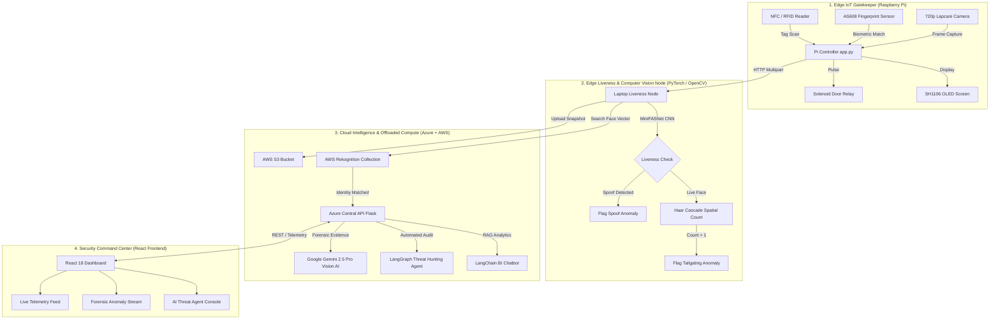

# 🛡️ Smart Campus Access & AI-Driven Attendance System

[](https://www.python.org/)
[](https://react.dev/)
[](https://vitejs.dev/)
[](https://azure.microsoft.com/)
[](https://aws.amazon.com/)
[](https://pytorch.org/)
[](https://www.langchain.com/langgraph)
[](https://deepmind.google/technologies/gemini/)

An enterprise-grade, **Hybrid Cloud-Edge AI Security & Attendance Architecture** built for educational institutions and high-security campuses. The system fuses **Edge IoT Multi-Factor Biometrics**, **PyTorch Liveness Detection (Anti-Spoofing)**, **AWS Cloud-Offloaded Face Recognition**, **Google Gemini 2.5 Multimodal Vision AI**, and an **Autonomous LangGraph AI Threat Hunting Agent**.

---

## 🏛️ System Architecture Topology



---

## ⚡ Key Highlights & Core Features

### 1. 🔒 Multi-Factor Edge Biometrics (Zero-Trust Access)
* **Hardware Integration:** Raspberry Pi controller managing an **MFRC522 RFID/NFC module**, **AS608 Optical Fingerprint sensor** (162+ local template memory), and an **SH1106 I2C OLED display**.
* **Exclusive Port Lock Management:** Intelligent process daemon management that safely releases `/dev/ttyAMA0` UART locks during real-time enrollment without crashing background verification services.

### 2. 👁️ PyTorch Liveness Detection & Anti-Spoofing (Edge AI)
* **Anti-Spoofing Model:** Lightweight **MiniFASNet CNNs** running on PyTorch to evaluate face depth, texture, and light reflection in real time.
* **Attack Prevention:** Instantly blocks presentation attacks (photos on phones, printed photographs, video replays).
* **Spatial Face Counting:** OpenCV Haar Cascades track the bounding box count to prevent **Tailgating / Piggybacking** through entry gates.

### 3. ☁️ Scalable Cloud Face Recognition & Hybrid Architecture
* **Decoupled Architecture:** Offloads heavy neural network computation from local hardware to **AWS Rekognition** and **AWS S3**, supporting **up to 20 Million face vectors** with sub-second matching latency.
* **Multi-Cloud Elasticity:** Application server and relational database deployed on **Microsoft Azure Web Apps**, ensuring seamless horizontal scalability.

### 4. 🤖 Autonomous LangGraph Threat Hunting Agent
* **ReAct Reasoning Loop:** Built using **LangGraph** and custom tool bindings (`get_user_logs`, `calculate_risk_score`, `flag_security_threat`).
* **Self-Directed Investigations:** The agent independently queries attendance logs, cross-references physical scans across gates, detects impossible travel speeds (credential sharing), calculates a dynamic **Risk Score**, and updates threat flags in the database without human intervention.

### 5. 🔍 Multimodal Vision AI (Google Gemini 2.5 Pro)
* **Automated Forensic Triage:** When an anomaly (Spoof or Tailgate) is triggered at a gate, the evidence snapshot is sent to **Gemini 2.5 Pro Vision**.
* **Contextual Intelligence:** Gemini analyzes the image scene, distinguishing real security threats from false positives (e.g., background passers-by).

### 6. 💬 Conversational BI & Natural Language Analytics
* **RAG Analytics Engine:** Powered by **LangChain**, allowing non-technical security personnel to query attendance records in natural language (e.g., *"Show me all unauthorized access attempts in the Computer Science department today"*).

### 7. 🛡️ Dynamic Role-Based Access Control (RBAC) & Glassmorphism UI
* **Scoped Visibility:** Dynamic permissions for `Student`, `Faculty`, `Department Head`, and `System Admin`.
* **Cyber Security Command Center:** Built with **React 18**, **Material-UI**, **Flowbite**, and **TailwindCSS**, featuring a futuristic glassmorphic dark theme with live telemetry feeds, risk chips, and interactive charts.

---

## 🛠️ Technology Stack

| Layer | Technologies & Frameworks |
| :--- | :--- |
| **Edge IoT (Gate)** | Raspberry Pi, Python 3.10, `mfrc522`, `adafruit-fingerprint`, `luma.oled`, `RPi.GPIO` |
| **Edge Computer Vision** | PyTorch, MiniFASNet, OpenCV, ONNX Runtime |
| **Cloud Infrastructure** | Microsoft Azure Web Apps, AWS Rekognition, AWS S3 |
| **Backend & AI** | Flask, Python, LangChain, LangGraph, Google Gemini 2.5 Pro, SQLite / PostgreSQL |
| **Frontend** | React 18, Vite, Material-UI (MUI), Flowbite React, TailwindCSS, Nivo Charts, Framer Motion |

---

## 📂 Repository Structure

```
smart-campus-access/
├── college-attendance-api/     # Azure Central Flask Application & AI Engine
│   ├── app.py                 # Core API Endpoints & Auth Middleware
│   ├── agent_tools.py         # LangGraph Threat Agent Tools & ReAct Logic
│   ├── ai_guardrails.py       # Prompt Sanitization & Dynamic RBAC Scoping
│   ├── auth_middleware.py     # JWT & Token Verification
│   └── database.py            # SQLite / PostgreSQL Connection Handlers
│
├── Silent-Face-Anti-Spoofing/ # PyTorch Liveness & Camera Node
│   ├── laptop_liveness_node.py# Web service running MiniFASNet & OpenCV Tracking
│   └── src/                   # Anti-spoofing model definitions & weights
│
├── pi_scripts/                # Raspberry Pi Hardware Controllers
│   ├── app.py                 # Pi Local Service Coordinator & Daemon Manager
│   ├── rfid_service.py        # NFC Scan, USB Camera Capture & Relay Trigger
│   ├── fingerprint_daemon.py  # AS608 Fingerprint Continuous Polling Loop
│   └── fingerprint_enroll.py  # Hardware Biometric Enrollment Utility
│
├── aws/                       # AWS Handler Modules
│   ├── ai_handler.py          # Rekognition Indexing & Vector Search
│   └── prompts.py             # Forensic Vision Analysis Prompts
│
├── frontend/                  # React 18 Cyber Command Center UI
│   ├── src/
│   │   ├── scenes/            # Dashboard, Logs, Anomalies, AI Chat, Agent Console
│   │   ├── components/        # Glassmorphic StatBoxes, Headers, Protected Routes
│   │   └── theme.js           # MUI Cyber Dark Theme Configuration
│   └── package.json
│
└── scripts/
    └── simulate_anomalies.py  # Automated Anomaly & Credential Sharing Test Suite
```

---

## 🚀 Quick Start & Installation

### 1. Central Backend (Azure / Local)
```bash
cd college-attendance-api
python -m venv venv
source venv/bin/activate  # On Windows: venv\Scripts\activate
pip install -r requirements.txt

# Set Environment Variables
export GOOGLE_API_KEY="your-gemini-key"
export AWS_ACCESS_KEY_ID="your-aws-key"
export AWS_SECRET_ACCESS_KEY="your-aws-secret"

# Start Server
python app.py
```

### 2. Edge Liveness Node (Laptop / Edge PC)
```bash
cd Silent-Face-Anti-Spoofing
pip install -r requirements.txt
python laptop_liveness_node.py
```

### 3. Frontend Command Center
```bash
cd frontend
npm install
npm run dev
```

### 4. Raspberry Pi Gatekeeper Setup
```bash
cd pi_scripts
python3 app.py
```

---

## 🧪 Threat Simulation Suite

To test the **LangGraph Threat Hunting Agent** and **Camera Anomalies Dashboard** without hardware attached, execute the automated anomaly generator:

```bash
python scripts/simulate_anomalies.py
```
This script simulates:
1. **Credential Sharing (Teleportation):** Card swiped at Location A and 3 seconds later at Location B (20km away).
2. **Impossible Sprint:** User logged entering Gate A and appearing inside Lab 1 within 2 seconds.

---

## 📄 License & Attribution
Developed as an advanced engineering project for Smart Campus Security & Automated Attendance. 
Contains custom anti-spoofing implementations adapted from Silent-Face-Anti-Spoofing.
